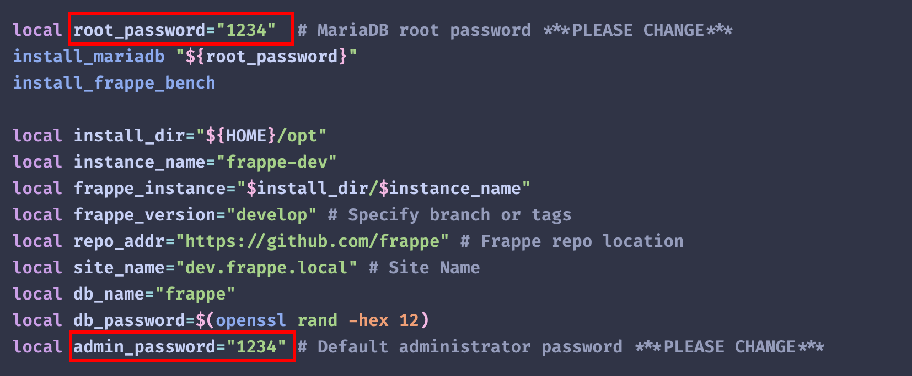

# Frappe Developer Machine Setup

## Windows/MacOS Preparation

### **Running on Windows using WSL**

1. **Check if WSL is installed:**

   - **Open Windows Terminal as Administrator.**
   - Run the following command:
     ```powershell
     wsl --list --verbose
     ```
   - If WSL is not installed, proceed to the next step.

2. **Enable WSL:**

   - Run the following command:
     ```powershell
     wsl --install
     ```
   - **Restart your computer.**

3. **Create a WSL instance named "frappe-dev":**

   - **Open Windows Terminal as Administrator.**
   - Run the following command:
     ```powershell
     wsl --install Ubuntu --name frappe-dev
     ```
   - Set user and password when the system prompted
   - Run the following command to exit from WSL:
     ```powershell
     exit
     ```

4. **Access the "frappe-dev" WSL instance:**
   - Run the following command:
     ```powershell
     wsl -d frappe-dev
     ```

### **Running on MacOS using colima**

1. **Install colima using Homebrew:**
   - Open Terminal
   - Run:
     ```bash
     brew install colima
     ```
2. **Create VM using limactl:**
   - Run:
     ```bash
     limactl create --name frappe-dev --cpu 4 --memory 4G --disk 16G
     ```
3. **Start the VM:**
   - List VMs to confirm creation:
     ```bash
     limactl list
     ```
   - Start the VM if not already running:
     ```bash
     limactl start frappe-dev
     ```
4. **Access the VM:**
   - Open a shell session in the VM:
     ```bash
     limactl shell frappe-dev
     ```

## Download and Run Installer Script

5. **Download the installer script using curl:**

   - In the terminal, run:
     ```bash
     curl -fsSL -o /tmp/installer.sh https://raw.githubusercontent.com/akarapol/frappe-dev-machine-installer/refs/heads/main/installer.sh
     ```

6. **Change variables in the script if needed:**

   - Open the script in a text editor, for example:

     ```bash
     nano /tmp/installer.sh
     ```

   - Change password for security purpose
     
   - Save and exit the editor.

7. **Run the script:**

   - In the WSL terminal, run:

     ```bash
     bash /tmp/installer.sh
     ```

   - Terminal session will restart after installation

## Running Frappe Development Server

8. **Start Development Environment:**

   - Run the following command:

     ```bash
     # for Windows using WSL
     wsl -d frappe-dev

     # for MacOS
     limactl start frappe-dev && limactl shell frappe-dev
     ```

   - In the terminal, run:
     ```bash
     cd ~/opt/frappe-dev
     bench start
     ```

9. **Using Frappe:**
   - Open Google Chrome
   - Navigate to http://localhost:8000
   - Login with user Administrator with password set in the installation script
